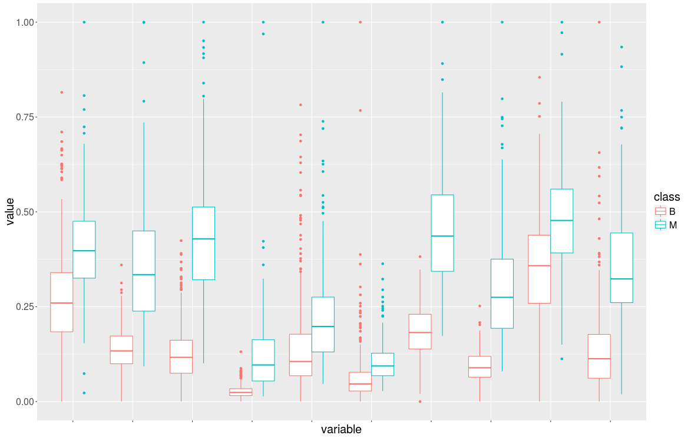

# Feature Selection

Contains implementations from scratch of several metaheuristics adjusted for feature selection, and its application to three
different datasets:

- [Wdbc](data/wdbc.arff)
- [Arrhythmia](data/arrhythmia.arff)
- [Movement Libras](data/movement_libras.arff)

## License
GNU licensed

## Files

* `bin` contains the implemented code.
    * Simulated Annealing `ES.r`
    * Local Search `BL.r`
    * Tabu Search: `BT.r`, `BText.r`
    * Basic Multirestart `BMB.r`
    * Genetic algorithms `AGs.r`
    * GRASP `GRASP.r`
    * ILS `ILS.r`
    * Ant Colony Optimization `OCH.r`
    * Memetic algorithms `AGs.r`
* `data` contains datasets, graphs and boxplots.
* `pscode` contains pseudocodes that are compiled to `.tex` doing `make`
* `tex` contains documentation, only available in Spanish:
    * `trajectories.tex`
    * `multi-restart.tex`
    * `genetic.tex`
    * `och.tex`
    * `memetic.tex`

## Usage

Execute `src/main.r` to get the results
of each algorithm.

For example, to gather the results from local search algorithm applied to all three datasets:
```r
BL.results <- cross.eval(BL) 
```

`params.r` contains settings used by the algorithms.


